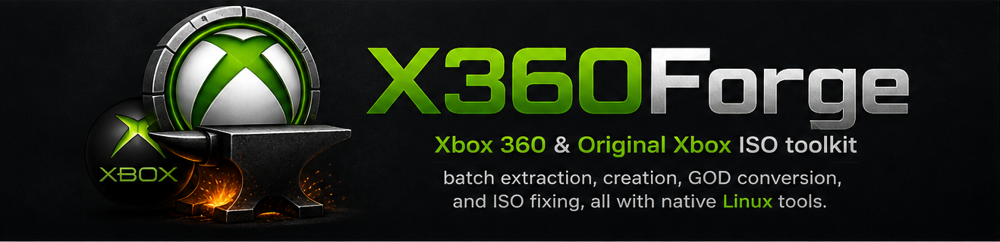

<p align="center">
  
</p>

<p align="center">
  
</p>

> A fully native Linux port of the original Windows-only Xbox 360 utility by BLAHPR.  
> No wine. No Windows tools. All binaries are built from source on Linux.

---

## Features

| Button | What it does |
|---|---|
| **Extract Game Folders from ISOs** | Pick a folder of `.iso` files and an output folder — extracts each ISO into a game folder |
| **Create ISOs from Game Folders** | Pick a source folder of game dirs (`.xex`/`.xbe`) and an output folder — creates an `.iso` for each |
| **Extract and Delete ISO Files** | Same as Extract, but permanently deletes source ISOs after extraction |
| **Delete Game Folders** | Permanently deletes extracted game folders containing `.xex` / `.xbe` |
| **Fix ISO (abgx360)** | Verifies and auto-fixes ISO headers, stealth sectors, and video padding |
| **ISO to GOD** | Converts an ISO to Games on Demand format (Xbox 360 and Original Xbox) |
| **GOD to ISO** | Reconstructs an ISO from a GOD package |

---

## Requirements

- Linux (Debian/Ubuntu, Fedora, or Arch-based)
- `sudo` access (for installing system packages)
- `git` (to clone with submodules)
- Internet connection (for the first build — downloads Rust toolchain if not already installed)

`build.sh` installs everything else automatically.

---

## Setup

```bash
git clone --recurse-submodules https://github.com/WB2024/Xbox360-Utility-Create-Extract.git
cd Xbox360-Utility-Create-Extract
bash build.sh
python3 main.pyw
```

That's it. `build.sh` will:
1. Install system packages (`python3-tk`, `cmake`, `gcc`, `libcurl-dev`, `zlib-dev`) via your distro's package manager
2. Install Rust via `rustup` if `cargo` is not already present
3. Install PyInstaller via `pip3` (using `--break-system-packages` on PEP 668 distros such as Debian 13+)
4. Initialise git submodules (if not already done)
5. Build `extract-xiso` from `x_tool/extract-xiso-src/`
6. Build `iso2god` from `x_tool/iso2god-rs/`
7. Build `god2iso` from `x_tool/god2iso-rs/`
8. Build `abgx360` from `x_tool/abgx360-src/`
9. Bundle everything into a standalone executable in `dist/`

If you already cloned without `--recurse-submodules`:

```bash
git submodule update --init --recursive
bash build.sh
```

### Manual build (without PyInstaller)

If you just want to run from source without bundling:

```bash
# Build extract-xiso
cd x_tool/extract-xiso-src && cmake -B build -S . && cmake --build build --parallel
cp build/extract-xiso ../extract-xiso && cd ../..

# Build iso2god
cd x_tool/iso2god-rs && cargo build --release
cp target/release/iso2god ../iso2god && cd ../..

# Build god2iso
cd x_tool/god2iso-rs && cargo build --release
cp target/release/god2iso ../god2iso && cd ../..

# Build abgx360
cd x_tool/abgx360-src && ./configure && make -j$(nproc)
cp src/abgx360 ../abgx360 && cd ../..
```

---

## Running

```bash
python3 main.pyw
```

The `x_tool/` directory must be in the same directory as `main.pyw`. All file and folder selection is done via in-app pickers.

---

## Usage Guide

### 1. Batch Extract ISOs → Game Folders

1. Click **Extract Game Folders from ISOs**
2. Select the folder containing your `.iso` files
3. Select the output folder where game folders will be extracted
4. Each ISO is extracted into a subfolder containing `.xex` or `.xbe` files

> Use **Extract and Delete ISO Files** to automatically remove the source ISOs after extraction.

---

### 2. Batch Create ISOs from Game Folders

1. Click **Create ISOs from Game Folders**
2. Select the folder containing your game directories (each must contain `.xex` or `.xbe` files)
3. Select the output folder where ISO files will be written
4. An `.iso` file is created for each valid game folder

> Newly created ISOs may have incorrect headers. Run **Fix ISO (abgx360)** on them afterwards.

---

### 3. Fix ISO (abgx360)

Fixes ISO headers, stealth sectors, and video padding so ISOs are burnable and compatible.

1. Click **Fix ISO (abgx360)**
2. Select the `.iso` file to fix
3. abgx360 runs with:
   - `--af3` — AutoFix level 3 (always fix, even if uncertain)
   - `-p` — fix video padding
   - `-s` — no colour codes (clean status output)
   - `-o` — offline mode (no network required)
4. Output streams live into the status window

---

### 4. ISO to GOD (Games on Demand)

Converts an Xbox 360 or Original Xbox ISO into GOD format for use on a console hard drive.

1. Click **ISO to GOD (GAMES ON DEMAND)**
2. Select your source `.iso` file
3. Select an output folder
4. The `iso2god` binary converts it — the resulting GOD package is written to the output folder

---

### 5. GOD to ISO

Reconstructs an ISO from a Games on Demand package.

1. Click **GOD to ISO (GAMES ON DEMAND)**
2. Select the GOD **package header file** — this is the file *without* an extension (not the `.data` folder)
3. Select an output folder
4. The `god2iso` binary reconstructs the `.iso` in the output folder

> The `god2iso` tool also supports a `--fix` flag on the CLI for the optional CreateIsoGood header fix.

---

### 6. Cleanup Buttons

| Button | Behaviour |
|---|---|
| **Delete Game Folders** | Permanently deletes all folders next to `x_ISO/` that contain `.xex` / `.xbe` files |

> Both destructive buttons are coloured red and prompt no confirmation — use with care.

---

## Project Structure

```
X360Forge/
├── main.pyw              # Main GUI application
├── x_create.py           # ISO creation logic
├── x_extract.py          # ISO extraction logic
├── translations.py       # UI string translations
├── build.sh              # Build script (tools + PyInstaller bundle)
├── Required.txt          # Dependency notes
├── x_ISO/                # Drop ISO files here for extraction
├── Images/               # App icon
└── x_tool/
    ├── extract-xiso      # ← built by build.sh
    ├── iso2god           # ← built by build.sh
    ├── god2iso           # ← built by build.sh
    ├── abgx360           # ← built by build.sh
    ├── extract-xiso-src/ # Source: XISO extraction tool (C, submodule)
    ├── iso2god-rs/       # Source: ISO → GOD converter (Rust)
    ├── god2iso-rs/       # Source: GOD → ISO converter (Rust)
    └── abgx360-src/      # Source: ISO fix/verify tool (C)
```

---

## Troubleshooting

**`extract-xiso` not found**  
Run `bash build.sh` or the manual cmake build above. If you cloned without `--recurse-submodules`, run `git submodule update --init --recursive` first.

**`iso2god` / `god2iso` / `abgx360` not found**  
Run `bash build.sh` or follow the manual build steps above. The binaries must be at `x_tool/iso2god`, `x_tool/god2iso`, and `x_tool/abgx360`.

**abgx360 configure fails**  
Ensure build dependencies are installed: `sudo apt install gcc libcurl4-openssl-dev zlib1g-dev`

**Cargo not found**  
Install Rust: `sudo apt install cargo` or via [rustup.rs](https://rustup.rs)

---

## Credits & Acknowledgements

| Contributor | Role |
|---|---|
| BLAHPR | Original utility author |
| WB2024 | Linux port, X360Forge |
| XboxDev | `extract-xiso` |
| iliazeus | `iso2god-rs` (Rust ISO→GOD) |
| raburton | Original `god2iso` (C#) |
| Seacrest / Bakasura | `abgx360` / `abgx360-reloaded` |
| rikyperdana | Contributions |
| rapperskull | Contributions |
| r4dius | Contributions |
| eliecharra | Contributions |
| markus-oberhumer + upx Team | UPX packer |
| &lt;in@fishtank.com&gt; | XISO format work |

---

Original Windows project: [github.com/BLAHPR/Xbox360-Utility-Create-Extract](https://github.com/BLAHPR/Xbox360-Utility-Create-Extract)  
Contact: geebob273@gmail.com
